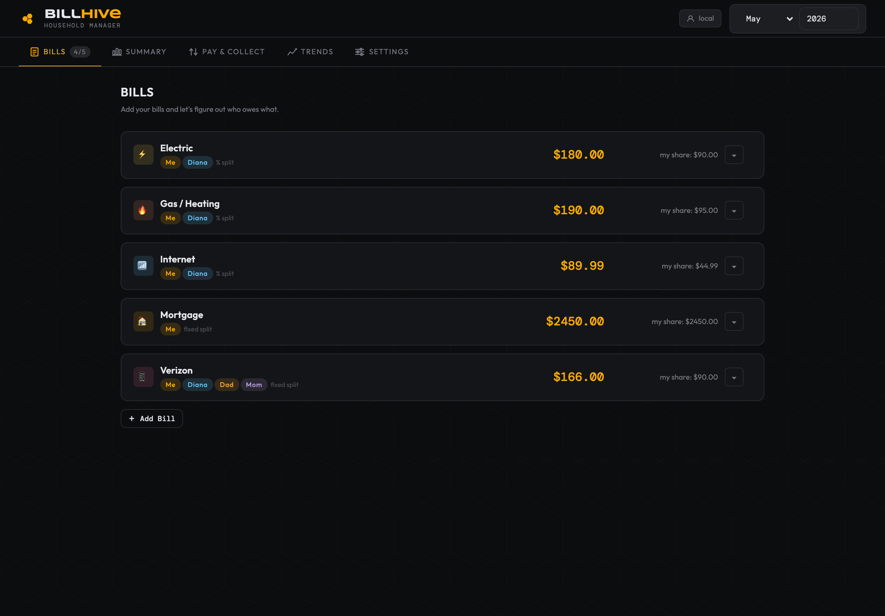
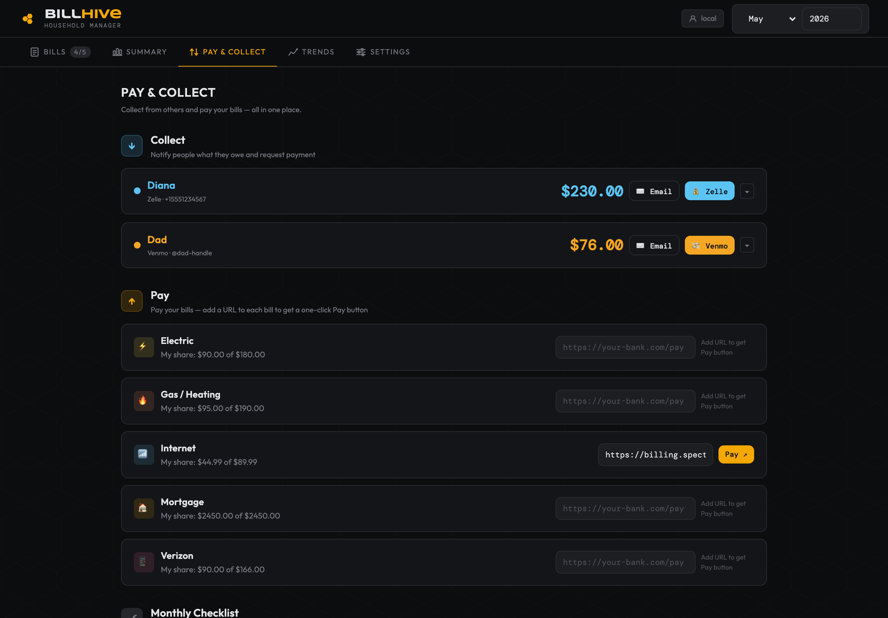
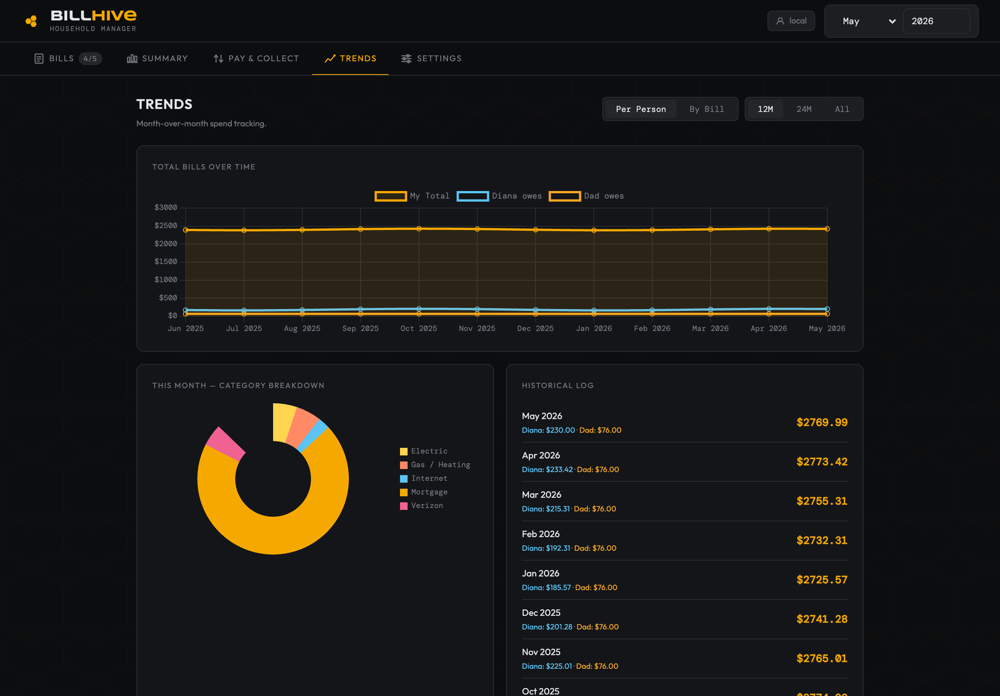
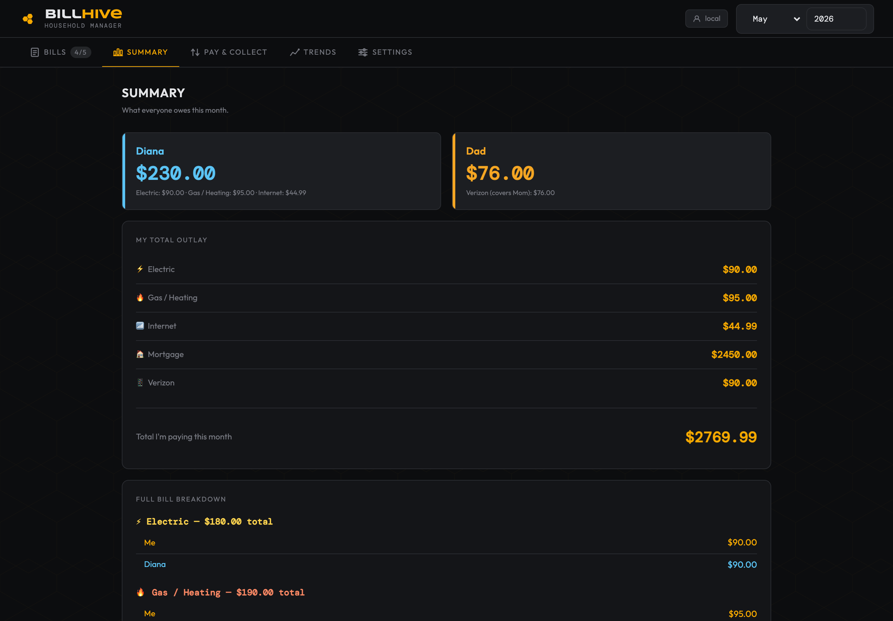
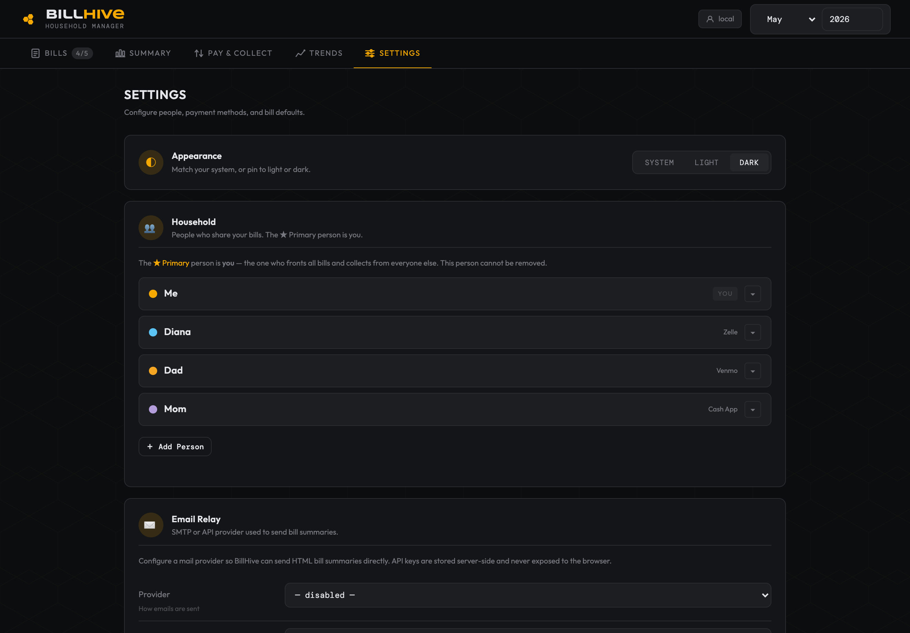
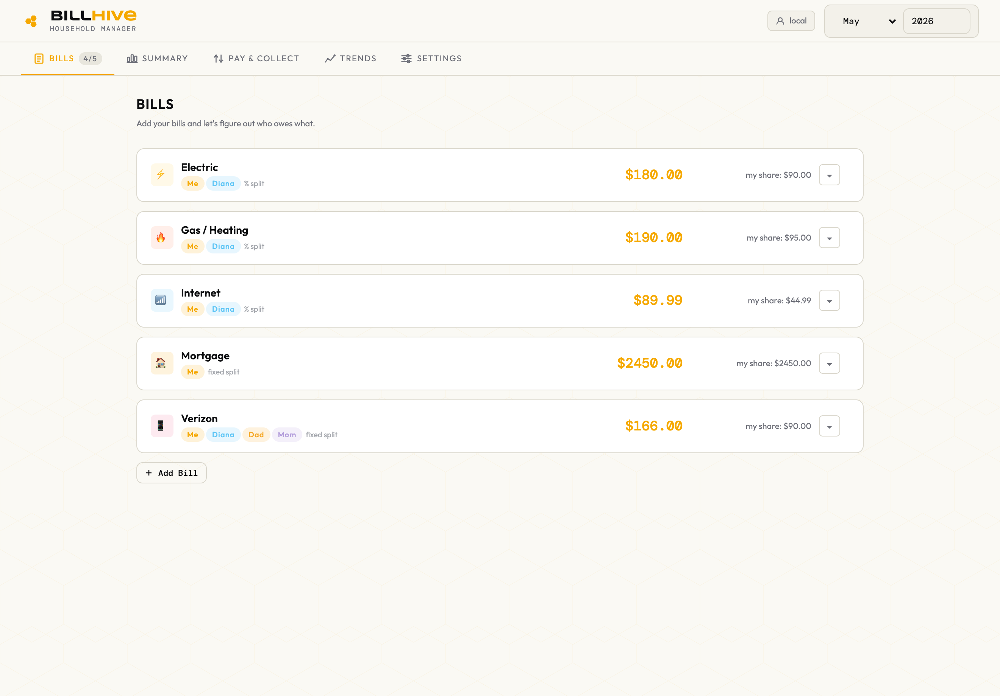
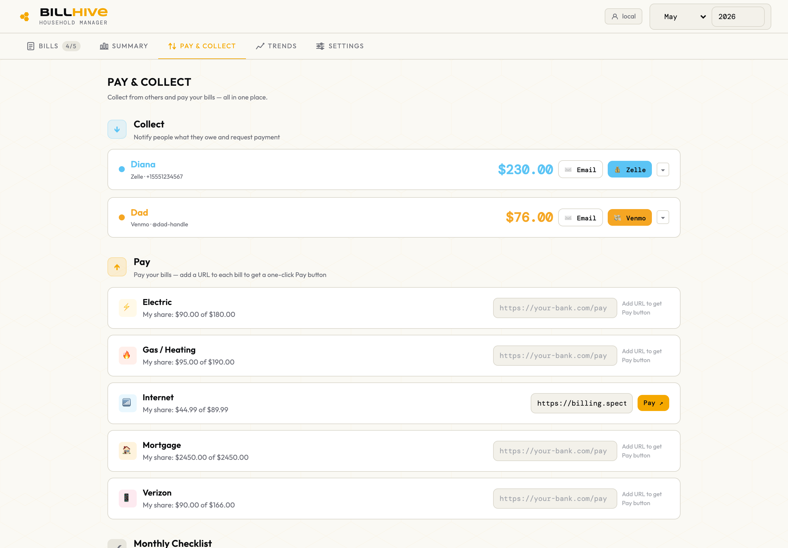

<p align="center">
  
</p>

<h1 align="center">BillHive</h1>

<p align="center">Self-hosted household bill management. One person fronts every bill — BillHive tracks the splits, generates Zelle/Venmo/Cash App payment links, and sends HTML email summaries to everyone who owes money.</p>

<p align="center">Runs as a <strong>single Docker container</strong> with a SQLite database. No cloud, no subscription, no external services required.</p>

---

## Screenshots

<p align="center">
  
  &nbsp;
  
  &nbsp;
  
</p>

<p align="center">
  
  &nbsp;
  
</p>

<p align="center">
  <em>Light theme</em><br>
  
  &nbsp;
  
</p>

---

## Features

**Bill splitting**
- Split bills by **percentage** or **fixed dollar amounts** per line
- Assign each line to a household member
- "Covered by" relationships — Dad can pay on Mom's behalf while Mom shows $0 owed
- Set a **remainder line** to absorb rounding on fixed-split bills
- **Auto-carry forward** amounts month-to-month for bills that don't change
- **Auto-pay** flag — skip bills you've set to draft automatically from the Pay tab and checklist

**Payment collection (Pay & Collect tab)**
- **Zelle, Venmo, and Cash App** deep-links auto-generated with the exact amount pre-filled
- Custom Zelle URLs supported for banks with their own enrollment flows
- One-click **HTML email summaries** sent to each person with their itemized bill breakdown
- Supports **Mailgun, SendGrid, Resend, and SMTP** — API keys stored server-side, never exposed to the browser
- Per-person greetings configurable from Settings

**Tracking & history**
- Summary tab shows each person's total owed with a full bill-by-bill breakdown
- **Trend charts** — per-person and per-bill views with line charts, donut breakdowns, and stacked bar charts powered by Chart.js
- **Monthly checklist** auto-generated from your people and bills — tracks what's been emailed, paid, and collected

**Look & feel**
- **Light, dark, and system** themes — toggle in Settings, persisted per user. Mirrors the iOS app's design language
- Real-time multi-device sync via Server-Sent Events — open the app in two tabs and watch one update the other instantly

**Infrastructure**
- Single Docker container — Node.js serves both the frontend and REST API
- Single-file vanilla-JS frontend — no build step, no framework, no bundler
- SQLite database in a named Docker volume — no external database required
- **Multi-user safe** — deploy behind Authelia or Authentik; BillHive reads the `Remote-User` / `X-Authentik-Username` header and scopes all data per user
- **Browser sessions are HMAC-signed**; per-device API keys for the iOS companion app
- Hardened defaults: Helmet headers, rate limiting, non-root container, sanitized email HTML
- Full JSON **export/import** backup via the Settings tab

---

## Quick Start

```bash
docker run -d \
  --name billhive \
  -p 8080:8080 \
  -v billhive-data:/data \
  ghcr.io/martyportatoes/billflow:latest
```

Open **http://localhost:8080**

---

## Docker Compose

```yaml
services:
  billhive:
    image: ghcr.io/martyportatoes/billflow:latest
    container_name: billhive
    restart: unless-stopped
    ports:
      - "8080:8080"
    volumes:
      - billhive-data:/data

volumes:
  billhive-data:
```

---

## Reverse Proxy Setup

Point your proxy at port `8080`. BillHive reads the following headers for user identity (first match wins):

| Header | Set by |
|---|---|
| `Remote-User` | Authelia |
| `X-Authentik-Username` | Authentik |
| `X-Forwarded-User` | Generic proxies |
| `X-Remote-User` | Generic proxies |

Without a proxy, all data is stored under user ID `local` (single-user mode).

You can override the trusted header list with the `TRUSTED_AUTH_HEADERS` env var if your proxy uses a different name, or to lock things down.

### Traefik labels

```yaml
labels:
  - "traefik.enable=true"
  - "traefik.http.routers.billhive.rule=Host(`bills.yourdomain.com`)"
  - "traefik.http.routers.billhive.entrypoints=websecure"
  - "traefik.http.routers.billhive.tls.certresolver=letsencrypt"
  - "traefik.http.routers.billhive.middlewares=authelia@docker"
  - "traefik.http.services.billhive.loadbalancer.server.port=8080"
```

---

## Data Persistence

SQLite lives in a named Docker volume at `/data/billhive.db`.

**Host-mounted path** (easier backups):
```yaml
volumes:
  billhive-data:
    driver: local
    driver_opts:
      type: none
      o: bind
      device: /your/host/path/billhive-data
```

**Backup via UI:** Settings → Data & Backup → Export Backup → downloads full JSON

**Backup via CLI:**
```bash
docker exec billhive sqlite3 /data/billhive.db .dump > backup.sql
```

**Restore:** Settings → Data & Backup → Import Backup → select `.json` file

---

## Environment Variables

| Variable | Default | Description |
|---|---|---|
| `PORT` | `8080` | Port the server listens on |
| `DB_PATH` | `/data/billhive.db` | SQLite database path |
| `TRUST_PROXY` | `1` | Express trust-proxy hop count. Set `0` to disable, higher for chained proxies |
| `TRUSTED_AUTH_HEADERS` | `remote-user,x-authentik-username,x-forwarded-user,x-remote-user` | Comma-separated headers honored for proxy-auth identity |

---

## API

Auth: every `/api/*` request must authenticate via one of: `Authorization: Bearer <key>` (iOS device key), the `bh_session` cookie (issued by the SPA on page load), or a trusted reverse-proxy header. `/api/health` is always public so iOS can probe reachability.

| Method | Path | Description |
|---|---|---|
| GET | `/api/health` | Health check + current user + whether device keys are required *(public)* |
| GET | `/api/state` | Load config (settings, people, bills, checklist) |
| PUT | `/api/state` | Save full config |
| PATCH | `/api/state/:key` | Save a single config key |
| GET | `/api/months` | All monthly data |
| GET | `/api/months/:key` | Single month (`YYYY-MM`) |
| PUT | `/api/months/:key` | Save month data |
| DELETE | `/api/months/:key` | Delete a month |
| GET | `/api/export` | Download full JSON backup |
| POST | `/api/import` | Restore from JSON backup |
| GET | `/api/email/config` | Get email config (secrets masked) |
| PUT | `/api/email/config` | Save email config |
| POST | `/api/email/test` | Send a test email |
| POST | `/api/email/send` | Send bill summary to a person |
| GET | `/api/keys` | List per-device API keys (no plaintext) |
| POST | `/api/keys` | Generate a new device key (returns plaintext **once**) |
| DELETE | `/api/keys/:id` | Revoke a device key |
| GET | `/api/auth/settings` | Whether iOS device keys are required + count |
| PUT | `/api/auth/settings` | Toggle the require-device-keys mode |
| GET | `/api/events` | Server-Sent Events stream (real-time multi-tab sync) |

---

## Updating

```bash
docker compose pull && docker compose up -d
```

Data in the volume is preserved across updates.

---

## iOS Companion App

A native iOS app called **SelfHive** is available on the App Store: [SelfHive — Bill Splitting](https://apps.apple.com/us/app/selfhive-bill-splitting/id6760245713). It connects directly to your self-hosted BillHive server. Source code: [github.com/MartyPortatoes/BillHive-iOS](https://github.com/MartyPortatoes/BillHive-iOS).

A standalone version of the app — simply called **BillHive** — uses local JSON storage with optional iCloud sync, for anyone not interested in self-hosting. Both targets ship from the same Xcode project.

### Securing iOS connections (optional)

If your server is reachable on a network where you don't fully trust every device — or you just want defense-in-depth — you can require iOS apps to authenticate with a per-device API key.

In the BillHive web app, go to **Settings → Connected Devices**:

1. Click **+ Generate Device Key**, name the device (e.g. "Marty's iPhone")
2. The key is shown **once** in plaintext — copy it now (we hash before storing)
3. In SelfHive, go to **Settings → Server → API Key** and paste it
4. Optionally flip **Require API key for iOS apps** to ON — any iOS app without a valid key will be rejected

To revoke: open **Connected Devices**, click **Revoke** next to the device. The key stops working immediately.

The web app keeps working with no key — browser sessions authenticate via a signed cookie issued on page load.

---

<p align="center">
  <a href="https://www.buymeacoffee.com/mportelos">
    
  </a>
</p>
